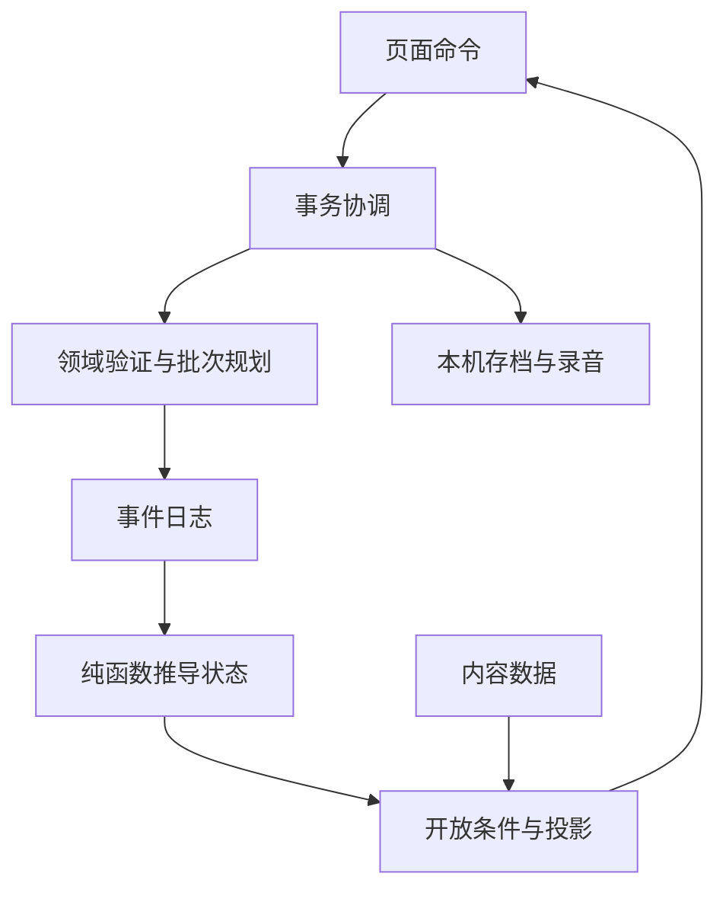

# 《明日随访》项目实现文档 · 00 册：总纲与决策

版本：1.1（2026-09-12）。基于原五册v1.0修订，保留题材、角色、技术栈、17个页面和三个结局。修订的重点是分支可达性、证据与解锁一致性、可解的录音排序，以及可独立验收的工作块。

本套五册是当前实施依据，旧剧本/方案供背景阅读；实施所需的条件、数据和页面设置均应能在本套中找到。变更目录与本轮实际验证见《05_v1.1修订记录与验证.md》。目前仍是实施规格，尚未因此产生可玩的完整游戏或真实盲测结果。

## 1. 产品目标与创作边界

玩家以外部复核者W07身份进入澄湾康复中心的迁移系统，发现签认之后一名患者的身份被预归档。经过病例、剧场档案、两个相反的结案界面、实验和旧录音，玩家发现异常依赖外部观察者确认一个终局。最终需要撤销错误授权关系，并证明有人仍在表达、下一班确实有人承接。

核心情感落在许棠和那颗未找齐的十字螺丝。救援结局恢复继续照护，不保证症状清零、不替患者决定下一步。林闻、其他五人的生活事项和台灯在场记录，承担与现实生活的联系。

| 项目 | 当前范围 |
|---|---|
| 产品 | 中文单人网页ARG，桌面优先，手机保底可完成 |
| 时长 | 首轮目标180–240分钟；须由试玩测量，不写成已经验证的成绩 |
| 页面 | 17个，P00–P16；单一SPA、4套虚构系统布局 |
| 谜题 | 9个：沿用p1–p8，录音重组补编号a1；另有m7/rnm两个简短文学判断 |
| 证据 | 27条EV记录，另有六人的ST当前陈述及其资料子引用 |
| 事件/投影 | 52个事件码；20条叙事标签投影，由注册项检查数量 |
| 结局 | A接受终局；B隔离；C明日随访；均可复盘 |
| 音频 | 11条资产AUD01–11；AUD02–07来自一个连续交班场景；CHANNEL_03_FULL是重组逻辑项 |
| 现实交互 | 本地交接文件、可选纸面记号/物件、本机语音或文字见证、可选文学原文阅读 |
| 运行依赖 | 静态站点、浏览器本机存档；无邮箱、热线、短信、账户、支付或动态AI服务 |
| 图片 | 一张可复用的护士站台灯氛围照片；工程图用SVG，答案不藏在位图中 |

文学作品分别提供不同的思考入口：《征服者蠕虫》对应观众对终局的确认与命名；《红死病的假面》提示检查封闭结构；《乌鸦》帮助辨认固定回答与不同解释；《厄舍府的倒塌》提示分开原始声响和叙事安排。每次判断还需要本案证据，作品不能单独证明游戏里的因果机制。

## 2. 五册职责与使用协议

| 册 | 内容权威范围 | 开发时如何使用 |
|---|---|---|
| 00 | 范围、决策、结构、体验目标 | 开始任务和遇到范围变化时阅读 |
| 01 | 类型、事件、状态、开放、gate、证据取得、存档 | 实现领域层与任何有状态交互前阅读对应节 |
| 02 | 严格JSON数据、原始资料、台词、提示、音频与文学出处 | 按文件标题抽取；公开文本不输出内部解法元数据 |
| 03 | 每页进入条件、界面、操作、去向、降级与验收 | 实现具体页面与跨页体验时使用 |
| 04 | 工作块、测试、音频生产、部署与试玩 | 根据依赖选任务，完成对应验收后继续 |

领域语义以01为准；内容正文以02为准；呈现与动线以03为准。不是用“01优先”掩盖错误：发现跨册冲突必须在同次修订中同步更改规则、例子与验收。

每个任务声明输入/产出/验收。可在同一次会话连续完成多个已授权且依赖满足的小任务，不要求每做一块就向用户请求确认。正常修错、补类型、细化交互可以自主完成并记录；新收费服务、外部联系或超出当前请求的发布，按用户已有授权处理。文档中的派生选择不冒充用户逐条确认。

编号统一写“页面P05”“谜题p1”“任务T14.1”；不要用一个裸P号同时指页面和谜题。代码标识符英文，剧情中文，必要约束用简短中文注释。测试应校验行为和不变量，不能只镜像实现中的if分支。

## 3. 沿用与修订决策

| ID | 决策 | 来源/状态 |
|---|---|---|
| D01 | 基于现有五册优化，完整覆盖实现并拆小任务 | 本轮用户授权 |
| D02 | 删除邮箱/热线及其付费链路，保留站内语音、叙事轨迹与现实交互 | 已明确的用户需求 |
| D03 | 原创剧情吸收医学调查、认知改写、现实留证与四部坡作品 | 沿用创作方向；避免把游戏改造误写为原作事实 |
| D04 | Vue3、Vite、TypeScript、Vue Router Hash、Pinia | 沿用v1.0技术基线，具体版本在T01锁定 |
| D05 | 静态托管，以GitHub Pages为默认实施目标 | 沿用方案；具体仓库/base在部署任务确定，不写死arggame |
| D06 | 先做找回许棠的纵切，再补全量内容与音频 | 沿用并加强：字幕纵切也必须能推进 |
| D07 | 桌面优先；手机可完成，键盘/字幕是完整路径 | 沿用；不承诺两类设备体验相同 |
| D08 | 配音可先用字幕和TTS占位；正式版自录或使用已核对授权的音源 | v1.1调整：不把非官方在线TTS列为发布必经步骤 |
| D09 | 原始事件只追加，系统叙事为投影；一次命令可提交原子事件批次 | v1.1明确事务边界 |
| D10 | SELF与REPLAY保留不同事实，通过规范化原因引用共享推理路径 | v1.1分支修复 |
| D11 | P13只模拟，P14集中准备与最终执行；C才真正接续下一班 | v1.1动线和结果修复 |
| D12 | 文档版本1.1；新实施存档schemaVersion=2，不伪造旧存档缺失事件 | v1.1数据修复 |
| D13 | 剧情日期、事件活跃时钟、电脑现实时间分别处理 | v1.1时间规则补齐 |

## 4. 必守规则及其工程保证

| 规则 | 对应保证 |
|---|---|
| 阅读不产生终局授权 | READ与ENDING分离；WATCH_REPLAY不生成玩家SUBMIT；声明范围由命令校验 |
| 终局解释需要可追溯的外部原因 | ReviewCause指向真实本局事件或固定历史记录；不可只根据当前颜色/按钮判断 |
| 单份预归档可复查，最终选择才锁定结果 | LINK只恢复身份；最终事务由P14提交；无隐性倒计时 |
| 恐怖只能改叙述与显示 | 原始事件、seq、scope和不可变留证不被改写；阶段变形可对照 |
| 保留事实与接续照护是不同步骤 | ASSEMBLE准备证据；C的成功事务才发OPEN_NEXT_VISIT；B仍封存 |
| 可靠副本不自动等于独立来源 | originGroup、derivedFrom明确EV01/02/03同源；p1不能用两个名单副本通过 |
| 设备权限不决定结局 | 音频内容可确认已读；固定见证文字等价；不识别玩家发音或现实环境 |
| 网页不越界伪造现实 | 不仿原生系统弹窗、真实通知、真实电话或邮箱；不读取剪贴板/位置来吓人 |
| 可暂停、可退出、可访问 | 稳定控件；无闪烁/爆音/强制全屏；字幕、键盘、200%文字和手机回流 |
| 玩家材料只留本机 | 录音不上传，导出默认只有文字；记录结束/离页立即释放麦克风 |
| 出错不能成为惩罚 | 存储、网络和资源失败采用真实提示与替代；不借故给坏结局 |

## 5. 架构与目录

Vue组件发命令；Pinia只协调串行事务、音频和设置；领域层验证命令并规划事件批次；保存成功后从不可变日志推导状态，selectors提供开放和视图。内容加载器按版本解析数据，表现层只能选择投影。存档草稿与事件事实有明确边界。

| 目录/模块 | 职责 |
|---|---|
| docs/00—05 | 五册实施规格及修订/验证记录 |
| src/game/types.ts、events.ts | 01册类型、事件注册与运行时字段验证 |
| src/game/commands.ts、reducer.ts | 命令前置条件、原子批次、无副作用重放 |
| src/game/gates.ts、availability.ts | 谜题判定；页面/卡片/证据/陈述开放 |
| src/game/evidence.ts、projection.ts | 来源注册、证据取得、正文与叙事投影 |
| src/game/hash-chain.ts、persistence.ts | 哈希、存档校验、导入导出、版本与写锁 |
| src/content/ | 02册15份JSON；不从页面拼接隐藏的第二套谜底 |
| src/stores/ | game、audio、settings；依赖领域函数，不把Vue写进领域层 |
| src/layouts/、src/pages/ | 四布局、P00–P16；页面名映射见03册 |
| src/components/ | 8个共享叙事组件；普通局部组件可合理拆分 |
| src/assets/images/、audio/、waveforms/ | 一张氛围照片、11段音频、时间轴与峰值 |
| scripts/check-content.mjs | JSON/引用/数量/变体/字幕/提示的构建检查 |
| scripts/audio/ | cue验证、连续master生成、切分、timings与peaks输出 |
| tests/unit/、tests/e2e/ | 领域不变量、分支与字幕全路径；测试不依赖未定义旧源稿 |
| .github/workflows/ | 构建/检查；部署按Pages artifact流程 |

领域可直接在Node中验证，不依赖Vue或真实麦克风；浏览器存储与声音通过适配层隔离。所有内容字段按纯文本/受控模板渲染，避免导入存档的文字成为执行代码。

## 6. 里程碑与开发顺序

M1完成P00→P05找回许棠：SELF与REPLAY、仅快照、字幕确认、保存恢复都能走通。首先验证玩家是否关心这名患者、是否主动使用原始留证。M1目标30–40分钟，45分钟为观察上限参考，不是计时门。

M2完成所有章节与三个结局，以完整客观字幕与波形占位为基准。录音排序先在文本/锚点原型中验证唯一解，再投入配音。所有当前陈述分散取得，后段不会突然自动发放六人证据。

M3完成音频、美术、设备走查、生产检查和第一轮5人桌面盲测。部署和试玩是后续实际工作，本轮更新文档不等于已经部署。提示使用与时长只在本机汇总，由测试者主动导出反馈文件交给组织者。

## 7. 名词与本轮不确定项

W07为玩家；W06是拒签路线历史回放里的复核者。收尾者是依赖被确认终局的异常存在，归档助手是它的界面出口。林闻为护士，提供现场事实及下一班承接。R03许棠是首位预归档患者。

NO_FURTHER是核心的同一个终止响应，正负界面为它添加相反解释。sourceId追踪文件出处，originGroup追踪原始信息产生过程。FACT_ONLY只确认已有事实；ENDING接受系统预填终局。原始scope始终不变，后期异议针对其被赋予的解释范围。

尚待实现/试玩确认：实际时长、录音是否自然、医院皮肤可信度、手机对照操作、正式配音来源、最终托管仓库。通过这些验证后才能声称达到发布标准。此处不阻止先完成已明确的代码任务。

下一册：[01_核心契约.md](01_核心契约.md)。
