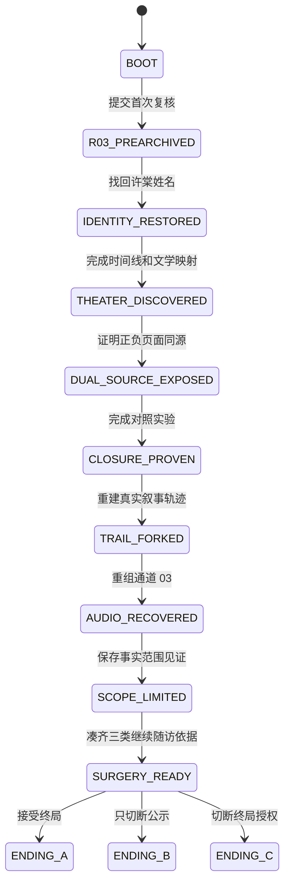

# 《明日随访》网页 ARG 实现方案

产品、页面、系统、素材与开发任务拆分 · V1.0

对应剧情稿：《明日随访》V1.2。

## 1. 最终实现边界

首版是一套无需账号和后端的单人网页 ARG：

- 标准首次体验目标为 180—240 分钟，剧情预算 210 分钟。
- 所有剧情入口属于同一个 Vue SPA，但通过布局、域名栏伪装和视觉体系表现为不同内部系统。
- 进度、叙事轨迹和录音保存在玩家浏览器中。
- 开局交接联和本局档案由浏览器生成本地文件。
- 文学原文允许跳转到独立站点核验，同时保留标明出处的站内摘录。
- 不做邮箱、短信、热线、账号、支付、实时数据库、在线聊天或运行时大模型。
- 不把刷新、网络失败、设备差异伪装成谜题。
- 首版仅生成一张氛围照片；所有承载线索的图像使用可控的 HTML、CSS、SVG 和预制音频。

技术选择为 **Vue 3 + Vite + TypeScript + Vue Router + Pinia**。使用 Composition API 与 `<script setup>`。Vue 官方文档支持以类型声明定义 props、emits 和响应式状态；Vite 可以构建为静态站点。浏览器录音使用 `MediaRecorder`，较大的录音 Blob 存入 IndexedDB。具体依赖安装时锁定当时的稳定版本，不在设计稿中写死版本号。

默认路由使用 `createWebHashHistory()`，例如 `/#/followup`。这样部署到任意普通静态托管后都不需要配置服务器重写。

首版不做 PWA。Service Worker 的旧缓存会让“页面被改写”与真实版本错误难以区分，增加测试和玩家支持成本。离线游戏以后可以作为独立版本处理。

---

## 2. 玩家流程与状态机



`phase` 不允许页面直接修改，而是由事件日志推导。这样同一个事件可以在不同阶段显示不同叙述，但它的动作对象和范围不会被真的改掉。

### 关键阶段枚举

```ts
type GamePhase =
  | 'BOOT'
  | 'R03_PREARCHIVED'
  | 'IDENTITY_RESTORED'
  | 'THEATER_DISCOVERED'
  | 'DUAL_SOURCE_EXPOSED'
  | 'CLOSURE_PROVEN'
  | 'TRAIL_FORKED'
  | 'AUDIO_RECOVERED'
  | 'SCOPE_LIMITED'
  | 'SURGERY_READY'
  | 'ENDING_A'
  | 'ENDING_B'
  | 'ENDING_C';
```

### 一次完整通关需要成立的事实

```ts
interface CompletionFacts {
  handoverSaved: boolean;
  r03Prearchived: boolean;
  r03IdentityRestored: boolean;
  timelineSolved: boolean;
  masqueInferenceSolved: boolean;
  wormInferenceSolved: boolean;
  dualSourceProven: boolean;
  experimentConclusion: 'UNKNOWN' | 'ENDING_WITNESS';
  trailForkCreated: boolean;
  audioOrderSolved: boolean;
  witnessScope: 'NONE' | 'FACT_ONLY' | 'ENDING';
  identityEvidenceCount: number;
  intentEvidenceCount: number;
  nextVisitOpened: boolean;
  severedEdge: null | 'A' | 'B' | 'C' | 'D' | 'E' | 'F';
}
```

完整结局 C 要求 `witnessScope === 'FACT_ONLY'`、`severedEdge === 'D'`、六人身份和意愿材料齐全，并且 `nextVisitOpened === true`。任何页面颜色、停留时间、麦克风权限和提示次数都不进入结局判断。

---

## 3. 工程目录

```text
src/
  app/
    router.ts
    bootstrap.ts
  game/
    types.ts
    event-codes.ts
    reducer.ts
    selectors.ts
    gates.ts
    mutations.ts
    persistence.ts
    export-import.ts
  content/
    patients.json
    evidence.json
    rules.json
    literature.json
    dialogue.json
    audio-manifest.json
    endings.json
  stores/
    game.ts
    audio.ts
    settings.ts
  layouts/
    HospitalLayout.vue
    ForumLayout.vue
    ArchiveLayout.vue
    LabLayout.vue
  pages/
    StartPage.vue
    MigrationPage.vue
    FollowupDashboard.vue
    PatientPage.vue
    ReviewPage.vue
    MedicationPage.vue
    ForumPage.vue
    ArchivePage.vue
    ComparePage.vue
    ExperimentPage.vue
    SlicePage.vue
    AudioConsolePage.vue
    SurgeryPage.vue
    NextHandoverPage.vue
    EndingPage.vue
    DebriefPage.vue
  components/
    NarrativeTrail.vue
    EvidenceBoard.vue
    SourceInspector.vue
    VersionDiff.vue
    AudioFragment.vue
    LocalWitness.vue
    GameDialog.vue
  assets/
    images/
    audio/
    waveforms/
    excerpts/
public/
  handover/
tests/
  reducer/
  e2e/
```

剧情文字和谜题数据与组件分离。编剧可以改 JSON/Markdown 内容，不必进入 Vue 组件修改流程。

---

## 4. 全局系统设置

### 4.1 事件日志与叙事轨迹

所有关键操作通过一个入口提交：

```ts
interface GameEvent {
  id: string;
  seq: number;
  elapsedMs: number;
  code: EventCode;
  target?: string;
  sourceId?: string;
  scope?: 'READ' | 'FACT' | 'ENDING';
  payload?: Record<string, string | number | boolean>;
  previousHash?: string;
  hash?: string;
}
```

- `elapsedMs` 是本局相对时间，不记录玩家真实时区。
- 每条事件只追加，不更新和删除。
- SHA-256 哈希链只承担游戏内“原始轨迹未改变”的叙事功能，不宣称具有现实安全性。
- 页面上看到的描述由 `getNarrativeLabel(event, phase)` 计算。同一个 `LINK_IDENTITY:R03`，早期显示“恢复许棠身份”，污染后显示“清理重复身份”。
- 玩家按下“显示原始事件”后只能看到动作、对象、来源、范围和顺序，不能直接看到编剧给出的解释。
- 调试模式可以查看所有事件和当前 gate，但生产构建默认关闭。

### 4.2 证据注册表

```ts
interface EvidenceItem {
  id: string;
  title: string;
  sourceId: string;
  sourceType: 'PRIMARY' | 'DERIVED' | 'PLAYER_LOCAL';
  availableFrom: GamePhase;
  alteredFrom?: GamePhase;
  originalContentKey: string;
  alteredContentKey?: string;
  supports: string[];
}
```

证据板不自动告诉玩家“这条支持哪个答案”。`supports` 仅供 gate 和测试使用。界面只显示来源、版本、事件时间、上传时间和玩家钉住的关联。

### 4.3 内容变形系统

变形只发生在表现层：

```ts
const content = resolveContent({ contentKey, phase, ending });
```

需要支持四类变形：

1. 字段值变化：六人变五人、姓名变空白。
2. 解释变化：恢复身份变成清理重复项。
3. 视觉名称变化：病历列表短暂显示为演员名单。
4. 来源变化：两个立场页面最后显示相同 `SOURCE_ID`。

不得通过真正改写历史事件实现恐怖效果。否则玩家刷新或导入存档后无法可靠复盘。

### 4.4 Gate 与谜题判定

每道谜题使用明确证据组合，不用字符串完全匹配：

```ts
interface GateRule {
  requiredEvidence: string[];
  requiredEvents?: EventCode[];
  validSelections?: string[][];
  nextPhase: GamePhase;
}
```

- 文本回答使用预设同义选项或关键概念选择，不接大模型。
- 排序题允许键盘上下移动。
- 错误回答显示具体冲突，不扣除次数。
- 提示不改变结局。

### 4.5 本地存档

- `localStorage`：设置、阶段、事件日志、证据板、谜题结果。
- IndexedDB：玩家可选录音 Blob。
- 每次关键事件后保存，不按固定时间轮询。
- 存档包含 `schemaVersion`，必须提供迁移函数。
- “导出本局档案”生成 JSON 文件，包含事件、证据和文字见证，不默认包含录音。
- “导入本局档案”先校验版本与基础结构，再覆盖当前存档。
- 开新游戏前显示清楚的二次确认和导出入口。

### 4.6 音频系统

- 剧情音频使用静态文件，建议主格式 AAC/M4A 或 MP3，附统一字幕 JSON。
- 波形峰值在构建前生成 JSON，运行时不做大文件分析。
- 六个录音碎片分别保存，允许独立播放、标记、排序和循环。
- 原始波形、自动转写和情节提示是三层独立数据。
- 浏览器自动播放默认关闭；第一次播放必须来自玩家点击。
- 同时只能有一个主要音频源播放。
- 全部音频提供等价字幕和视觉事件标记。

本地见证通过 `navigator.mediaDevices.getUserMedia({ audio: true })` 和 `MediaRecorder` 实现。调用前先解释用途，录制结束立即关闭 MediaStream tracks。运行时用 `MediaRecorder.isTypeSupported()` 选择格式。若 API 不可用或玩家拒绝授权，直接切到文字见证，不报错、不降结局。

麦克风能力通常要求 HTTPS 或 localhost 安全上下文。若页面通过 `file://`、不安全 HTTP 或不支持的浏览器打开，直接显示文字见证，不反复请求权限。每章开始时预载本章必要音频，避免解谜过程中才出现大文件等待。

### 4.7 页面来源伪装

所有页面仍在同一站点，顶部地址栏是游戏 UI，不伪造浏览器原生地址栏：

- 医院：`intra.chengwan/followup`
- 病友留言板：`bbs.chengwan.help`
- 地方档案：`archive.chengwan.local`
- 病理工作台：`lab.chengwan/review`

来源检查器最终显示它们都从 `CW-ARCHIVE-BATCH-0617` 派生。真实浏览器地址始终可见，避免诱导玩家认为网页控制了设备。

### 4.8 无障碍与操作安全

- 正文至少 16px，关键标签至少 14px。
- 所有操作支持键盘、清晰焦点和 200% 文本放大。
- 不用颜色作为唯一信息；七房间颜色同时提供编号和名称。
- 不使用自动闪烁、突然满音量、假系统弹窗或阻止退出。
- 音频谜题提供字幕事件，不要求辨认左右耳或高频声音。
- 拖拽同时提供“选择后上移/下移”按钮。
- 页面污染时仍保留“退出、设置、字幕、继续时间”四项稳定控件。

---

## 5. 页面地图

| 编号 | 路由 | 页面/系统 | 首次开放阶段 | 核心任务 |
|---|---|---|---|---|
| P00 | `/#/` | 开始与恢复 | BOOT | 新游戏、继续、声音和存档说明 |
| P01 | `/#/migration` | 迁移交接页 | BOOT | 下载交接联、抄写、确认规则 |
| P02 | `/#/followup` | 随访总览 | BOOT | 查看六人、观察 R03 消失 |
| P03 | `/#/followup/patient/:id` | 患者详情 | BOOT | 查看病历、本人陈述和版本 |
| P04 | `/#/followup/review/:id` | 外部复核 | BOOT | 首次提交、后期限定见证范围 |
| P05 | `/#/medication` | 发药与出院对照 | R03_PREARCHIVED | 证明第六人不是重复数据 |
| P06 | `/#/forum` | 病友留言板 | IDENTITY_RESTORED | 收集三种剧院梦境视角 |
| P07 | `/#/archive` | 地方档案与文学卡 | IDENTITY_RESTORED | 平面图叠合、四部作品线索 |
| P08 | `/#/compare` | 正向/负向平行复核 | THEATER_DISCOVERED | 证明两种立场同源 |
| P09 | `/#/lab/experiment` | 单变量实验 | DUAL_SOURCE_EXPOSED | 找出真正触发变量 |
| P10 | `/#/lab/slices` | 病理切片 | CLOSURE_PROVEN | 看见由删改痕迹组成的蠕虫 |
| P11 | `/#/trail` | 叙事轨迹全屏页 | CLOSURE_PROVEN | 重建玩家实际行为顺序 |
| P12 | `/#/audio/channel-03` | 交班录音台 | TRAIL_FORKED | 关闭情节提示、重组六段音频 |
| P13 | `/#/lab/surgery` | 连接切除模拟 | AUDIO_RECOVERED | 判断应切除哪一条授权关系 |
| P14 | `/#/handover/next` | 下一班交接 | SCOPE_LIMITED | 凑齐身份、意愿和承接依据 |
| P15 | `/#/ending/:endingId` | 三个结局 | SURGERY_READY | 展示选择后果 |
| P16 | `/#/debrief` | 结局复盘 | 任一结局 | 回看误判、证据和真实机制 |

全局叙事轨迹抽屉在 P01 之后始终存在；P11 是它在第四幕中的完整工作台版本。

---

## 6. 每个页面的具体设置

### P00 开始与恢复

**首屏：**不使用营销式大标题。中央显示值班台登录卡：“外部复核终端／等待交接”。底部显示预计时长、需要纸笔、可暂停、耳机建议和本地存储说明。

**操作：**新建 W07 会话、继续上次会话、导入本局档案、声音测试、字幕开关。

**状态：**存在旧存档时默认突出“继续”；新游戏会生成 `sessionId` 和 `BOOT_SESSION`。

**验收：**键盘可以完成全部启动操作；声音测试不自动播放；用户关闭页面后可继续。

### P01 迁移交接页

**视觉：**旧式医院内网页，宽表格、灰绿标题条、扫描日期和迁移批次号。核心照片使用本次生成的护士站台灯图，作为普通现场照片，不承载隐藏密码。

**交互：**

1. 点击“保存交接联 00”，用 Blob 下载 `CHENGWAN_HANDOVER_00.txt`。
2. 页面要求玩家把 `R03 / 许棠 / 台灯还差一颗螺丝` 抄在纸上，并自己做一个记号。
3. 展开六条值班须知并逐条确认已阅读。

**事件：**`DOWNLOAD_HANDOVER`、`ACK_PAPER_NOTE`、`ACK_RULES`。

**Gate：**下载失败时可以打开只读初始快照；必须确认已保存其中一种副本才能进入随访页。

### P02 随访总览

**初始状态：**六张患者行，R03 处于“待外部复核”，其他五人为“资料待补”。顶部数字为在册 6、待复核 1、待随访 6。

**首次提交后：**总数变为 5；R03 行收缩成无文字空白；搜索许棠返回 0；叙事轨迹新增 `INDEX_RECOUNT / COUNT=5`。

**阶段变形：**

- THEATER_DISCOVERED：标题短暂从“病历列表”变为“演员名单”。
- CLOSURE_PROVEN：第七行 W07 出现。
- ENDING_C：恢复六人，显示“本次确认出院 0、已恢复随访 6”。

**验收：**不通过删除 DOM 制造空白行；R03 仍有可聚焦位置和无障碍描述“记录关联缺失”。

### P03 患者详情

六位患者共享模板：身份、临床观察、本人陈述、护理事项、来源、版本历史。

**R03 特殊状态：**

- BOOT：显示完整姓名与台灯事项。
- R03_PREARCHIVED：姓名字段显示空白，护理记录仍存在。
- IDENTITY_RESTORED：姓名恢复，标记“依据：交接联 00”。
- CLOSURE_PROVEN：在线本人陈述被改为“台灯已修好，无后续事项”。
- ENDING_C：恢复原话并新增“明日继续检查”。

其余五人的原始陈述分散开放，最后必须各有一条尚未完成的事项。不要把疾病名称做成谜题答案。

### P04 外部复核页

**布局：**左侧护理事实，右侧系统预填结论，底部固定授权范围。

**关键文案：**首次按钮仍叫“完成单份复核”，但其上方必须能展开看见：“本次确认将作为结局判定的外部依据。”

**事件：**`SUBMIT_REVIEW:R03 / SCOPE=ENDING`。

**后期状态：**玩家可以改成 `SCOPE=FACT_ONLY`，并看到不会触发预归档的预览。

**验收：**开头的危险授权不可完全隐藏；拒绝提交者可看上一位独立复核者的只读回放继续剧情。

### P05 发药与出院对照

**内容：**六份发药签收、五份可见身份、五份出院/转院去向、一次索引重算日志。

**交互一：**系统建议把第六份药改为“损耗”。玩家先看变更预览，可取消或撤销。

**交互二：**将两份记录钉到对照板，选择冲突类型和支持证据。

**谜题结果：**证明 R03 仍接受过护理，被删除的是护理事实指向具体身份的连接。

**事件：**`COMPARE_RECORDS`、`RESTORE_IDENTITY:R03`。

### P06 病友留言板

**视觉：**更松散的旧论坛样式，头像统一为几何占位，不生成患者面孔。

**内容：**陈桥、宋渺、许棠的三段剧院梦境；回复中混有普通康复讨论，避免每行都是线索。

**交互：**按“地点、循环、结尾、观众”给帖子做标签。三个帖子被关联后解锁档案站入口。

**污染：**后期帖子文字仍在，但作者栏逐步变成“已离院用户”；来源检查能看到原作者 ID。

### P07 地方档案与文学卡

**区域一：平面图叠合。**拖动透明度比较旧剧院和康复中心：病房对应后台，护士站对应提词位，远程复核室对应观众席。提供键盘滑杆。

**区域二：M-7《红死病的假面》。**显示七层结构、安全日志零入站事件和空白的第七层。玩家判断异常来自封闭结构内部。

**区域三：W-F《征服者蠕虫》。**核对观众在最后作出的确认，将其关联到 W07 的签认日志。

**区域四：R-NM《乌鸦》。**初次仅展示锁定卡，P08 后开放。

**区域五：U-R《厄舍府的倒塌》。**初次仅展示锁定卡，P12 开放。

每张卡提供约 200—250 字中文说明、50—100 字以内的必要原文片段或转述、版本出处和站外原文链接。文学卡用于提出可验证判断，不要求识别名句。

### P08 正向/负向平行复核

**桌面：**主窗和弹出窗并排。移动端使用固定对照栏。

**正向页面：**主张“既然患者痛苦下降，是否可以结束随访？”

**负向页面：**主张“既然患者痛苦无法消除，是否应承认失败并结束随访？”

二者最终都显示 `NO_FURTHER_ACTION`。共同错字、批次号、缺失句和 `SOURCE_ID` 可在来源检查器里比对。

**R-NM 解锁：**《乌鸦》提示固定回答的意义由问题不断补足。玩家把两个界面判定为同源、同一终止接口。

**事件：**`PROVE_SHARED_SOURCE`、`LOAD_CARD:R-NM`。

### P09 单变量实验

**界面：**左侧四个变量，右侧实时显示身份是否保留；顶部明确标“归档副本实验”。

**最少实验：**A/B 比较外部确认、B/D 比较正负、B/E 比较评分、B/F 比较确认范围。

**笔记板：**玩家选择“改变的变量”和“没有改变的变量”。系统只有在有效对照成立时接受结论。

**正确结论：**正负标签和痛苦评分都不是充分条件；结局标签与外部终局确认共同触发预归档。

### P10 病理切片

**实现：**六层 SVG 或 Canvas 叠片。每层对应同一记录的处理阶段；透明度滑杆和逐层开关必须可键盘操作。

**形象：**蠕虫不是写实生物图，而是从姓名缺口、签名删线和空白字段中形成的连续轮廓。

**检查点：**放大后出现重复授权关系：“已核对事实，因此接受终局。”

这页不加入找像素、暗色差或图片隐写。

### P11 叙事轨迹全屏页

**三栏：**系统当前叙述、原始事件码、玩家证据板。

**操作：**把 `LOAD_SNAPSHOT`、`LINK_IDENTITY`、`SUBMIT_REVIEW` 三项拖入真实顺序，再为每项关联一个独立证据。

**成功结果：**建立本地异议分支，页面同时保留“系统版本”和“W07 复核版本”。

**失败反馈：**指出缺少的是顺序、对象还是授权范围，不说“答案错误”。

### P12 交班录音台

**三层显示：**原始波形、自动转写、情节提示。默认开启后两层。

**U-R 解锁：**《厄舍府的倒塌》提示文字与声响对应时先检查因果顺序。玩家发现情节提示生成在原始声响之前。

**六段音频：**通过整点报时、药车两声提示、走廊脚步、台灯开关建立顺序。完整字幕显示相同的事件锚点。

**成功结果：**恢复许棠在终局声明之后说出的“明天要是还在，我自己看看”。

**本地见证：**玩家可录下或选择文字“我只确认许棠仍在表达，不确认她的结局”，生成 `WITNESS_SCOPE:FACT_ONLY`。

### P13 连接切除模拟

**界面：**六节点关系图，节点可通过列表替代访问。

**六条边：**患者→本人陈述、护理记录→身份、外部见证→护理事实、外部见证→终局、后续随访→护理记录、终局→公示队列。

每次选择先在副本里播放后果：清空病历会丢失救援证据；只切公示会留下隔离状态；切 D 会解除终局闭合并保留护理。

正式提交前显示完整范围，错误模拟可无限撤销。

### P14 下一班交接

**三列证据槽：**身份、当前意愿、后续承接。

每位患者必须至少有一条身份证据和一条本人事项；林闻的新交班负责承接，不需要重复播放六段完整语音。

**最后动作：**将三类依据放入“下一班”，生成 `RESTORE_IDENTITY`、`PRESERVE_INTENT`、`OPEN_NEXT_VISIT`。

根据切除结果和范围见证，进入 A、B 或 C。

### P15 三个结局

**ENDING_A：**极度整洁的空表，康复率 100%、患者 0、待随访 0；台灯开关响但不亮。

**ENDING_B：**所有外部入口停止污染，六份病历停在封存状态；页面显示“仍待联系”。

**ENDING_C：**普通医院表格恢复，六个人重新出现，本次确认出院 0、已恢复随访 6。叙事轨迹进入游戏内次日，出现林闻的新交班。

结局页必须提供“复盘、导出本局档案、重新开始、退出”四个明确动作，不用停留时长触发追加恐吓。

### P16 结局复盘

玩家用五张卡重排：旧剧院结构、病历模板、外部终局授权、身份覆盖、继续随访。

复盘显示：

- 玩家曾建立的每个错误假说。
- 推翻它的两项证据。
- 四部坡作品各自提供了哪条结构线索。
- 三个结局的触发条件，不隐藏所谓“真结局”的获得方法。

---

## 7. 视觉与素材清单

### 视觉基调

关键词：**普通机构、夜班、旧系统、可核对的异常**。

| Token | 值 | 用途 |
|---|---|---|
| `--bg` | `#E8ECEA` | 医院主背景 |
| `--surface` | `#F7F8F6` | 表格和卡片 |
| `--text` | `#1D2926` | 正文 |
| `--muted` | `#61706B` | 次级信息 |
| `--line` | `#B8C2BE` | 表格与分隔 |
| `--clinical` | `#39705E` | 普通护理状态 |
| `--warning` | `#9A6925` | 待核验 |
| `--anomaly` | `#9D332F` | 异常与删改痕迹，限制使用 |
| `--room-black` | `#111615` | 第七层和切片背景 |
| `--room-scarlet` | `#8C1D23` | M-7 的猩红窗格提示 |

字体使用系统中文无衬线栈；档案标题可使用系统宋体栈；事件码使用 `ui-monospace`。不加载第三方在线字体。

### 本次生成的图片

**护士站台灯基调图：**空无一人的夜间康复病区，白色旧台灯处于维修状态，远处是药车和空床。用途为 P01 现场照片、P03 R03 护理附件或结局回望的裁切底图。它只建立真实感，不承载必须识别的螺丝型号、时间或人数。

不再生成患者肖像、怪物、乌鸦、面具或厄舍府插画。它们会把当前“行政记录逐步变成仪式”的独特感拉回常见恐怖视觉。

### 必须精确制作的 SVG/CSS 素材

1. 旧剧院与康复中心叠合平面图。
2. M-7 七层结构图。
3. 六层病理切片与蠕虫空白轮廓。
4. 手术节点关系图。
5. 叙事轨迹差异视图。
6. 六段音频的预计算波形。

### 音频资产

| 编号 | 内容 | 时长目标 |
|---|---|---:|
| AUD01 | 林闻第一次无归属留言 | 45—60 秒 |
| AUD02—AUD07 | 通道 03 六个错序片段 | 合计 4—5 分钟 |
| AUD08 | 归档助手的“善意”解释 | 50—70 秒 |
| AUD09 | 结局 A 台灯与空病区 | 15—20 秒 |
| AUD10 | 结局 B 最后一条交班 | 25—35 秒 |
| AUD11 | 结局 C 次日交班 | 45—60 秒 |

环境声锚点在录音剧本阶段就固定：整点报时、药车两声、脚步、台灯开关。后期不能随意替换，否则会破坏排序题。

---

## 8. 小任务拆分

每项应控制在半天到一天内，可独立验收。编号顺序已经考虑依赖。

### A. 内容冻结与数据准备

| ID | 任务 | 依赖 | 验收 |
|---|---|---|---|
| A01 | 建立 17 个页面的内容表 | 无 | 每页有进入条件、离开条件、关键文案 |
| A02 | 固定 GamePhase 与事件码清单 | A01 | 不存在同一动作使用两个事件码 |
| A03 | 建立 27 条证据注册表 | A01 | 每条有来源、版本、开放阶段和支持关系 |
| A04 | 完成六位患者的原始资料 | A03 | 每人有身份、护理、本人事项和承接 |
| A05 | 完成四张文学研究卡文案 | A03 | 每张只产生一个可验证推理作用 |
| A06 | 写定 AUD01—AUD11 音频逐字稿 | A04 | 所有环境声锚点进入台本 |
| A07 | 写定三结局和复盘卡 | A02 | 每个结局条件与状态机一致 |

### B. 工程骨架

| ID | 任务 | 依赖 | 验收 |
|---|---|---|---|
| B01 | 初始化 Vue 3/Vite/TS 工程 | 无 | 开发、构建、预览命令可运行 |
| B02 | 配置 Hash Router 和四套 Layout | B01 | 所有路由刷新后可打开 |
| B03 | 建立视觉 token 和基础排版 | B01 | 桌面、移动、200% 字体无溢出 |
| B04 | 建立 Pinia game store | A02,B01 | 能追加事件并推导 phase |
| B05 | 实现 reducer/selectors/gates | B04 | 三条结局路径可由测试数据推导 |
| B06 | 实现内容 manifest 加载 | A03,B01 | 页面不硬编码剧情大段文本 |
| B07 | 实现开发调试面板 | B04 | 可跳阶段、看 gate、重置存档；生产关闭 |

### C. 本地状态和轨迹

| ID | 任务 | 依赖 | 验收 |
|---|---|---|---|
| C01 | 实现 localStorage 存档 | B04 | 关键动作后刷新不丢进度 |
| C02 | 实现 schemaVersion 与迁移 | C01 | 旧测试存档可升级或给出明确错误 |
| C03 | 实现事件哈希链 | B04 | 任一测试篡改可被调试面板识别 |
| C04 | 实现叙事标签投影 | C03,A02 | 同一事件随 phase 显示不同解释 |
| C05 | 实现轨迹抽屉 | C04 | 任意主要页面可打开，不遮挡退出控件 |
| C06 | 实现轨迹全屏重建题 | C04,A03 | 顺序、证据和范围均参与判定 |
| C07 | 实现存档 JSON 导入导出 | C01 | 导出后新浏览器可恢复文字进度 |

### D. 第一条可玩纵切

| ID | 任务 | 依赖 | 验收 |
|---|---|---|---|
| D01 | 完成 P00 开始页 | B02,C01 | 新建、继续、导入均可用 |
| D02 | 完成 P01 迁移页和 TXT 下载 | D01,A04 | 生成内容正确的交接联 |
| D03 | 完成 P02 随访总览 | D02,B05 | 提交后 6→5 和 R03 空白正确出现 |
| D04 | 完成 P03/P04 患者与复核页 | D03,A04 | 授权范围可查看；拒签回放可继续 |
| D05 | 完成 P05 发药对照 | D04,A03 | 能证明身份连接异常并恢复姓名 |
| D06 | 纵切可玩测试 | D01—D05 | 新玩家可在 30—45 分钟到达恢复 R03 |

### E. 剧院与文学线索

| ID | 任务 | 依赖 | 验收 |
|---|---|---|---|
| E01 | 完成 P06 留言板 | D05,A04 | 三帖关联后开放档案入口 |
| E02 | 绘制平面叠合 SVG | A01 | 两图坐标完全对应且有键盘滑杆 |
| E03 | 完成 P07 档案页框架 | E01,E02 | 研究卡可按阶段开放 |
| E04 | 实现 M-7 七层推理 | E03,A05 | 玩家能排除外部入侵解释 |
| E05 | 实现 W-F 观众确认推理 | E03,A05 | 能关联诗歌、座位和复核日志 |
| E06 | 实现剧场化页面变形 | E05,C04 | 只改变表现层，原始事件不变 |

### F. 正负选择与病理实验

| ID | 任务 | 依赖 | 验收 |
|---|---|---|---|
| F01 | 完成 P08 双窗对照布局 | E06 | 桌面并排、移动端对照均可用 |
| F02 | 实现来源检查器 | F01,A03 | 能显示共同错字、批次和 SOURCE_ID |
| F03 | 实现 R-NM 固定答案线索 | F02,A05 | 玩家能判断两个页面调用同一接口 |
| F04 | 完成 P09 单变量实验 | F03,B05 | 四组有效对照均确判定 |
| F05 | 绘制六层病理切片 | A03 | 每一层删改范围与剧情一致 |
| F06 | 完成 P10 切片交互 | F04,F05 | 可看见授权语句形成连续空白 |

### G. 语音与本地见证

| ID | 任务 | 依赖 | 验收 |
|---|---|---|---|
| G01 | 录制或制作 AUD01—AUD11 | A06 | 台词、时长和环境声符合清单 |
| G02 | 切分通道 03 六段音频 | G01 | 每段存在可识别且字幕化的锚点 |
| G03 | 生成波形峰值 JSON | G02 | 波形与音频时间轴一致 |
| G04 | 完成 P12 三层录音台 | C06,G02,G03 | 可关闭情节提示并排序 |
| G05 | 实现 U-R 因果顺序线索 | G04,A05 | 玩家会先检查文本和声音谁先发生 |
| G06 | 实现 MediaRecorder 本地录音 | G04 | 录音只存 IndexedDB，停止后释放麦克风 |
| G07 | 实现文字见证回退 | G06 | 拒绝权限仍生成同一 FACT_ONLY 事件 |

### H. 终局与发布质量

| ID | 任务 | 依赖 | 验收 |
|---|---|---|---|
| H01 | 绘制手术关系图 | F06 | 图形和列表两种操作完全等价 |
| H02 | 完成 P13 模拟切除 | H01,G07 | A—F 均有清楚后果且可撤销 |
| H03 | 完成 P14 下一班交接 | H02,A04 | 六人三类依据可核对 |
| H04 | 完成 P15 三结局 | H03,A07 | A/B/C 触发条件稳定、无误触 |
| H05 | 完成 P16 复盘 | H04,A07 | 能解释所有反转与文学线索 |
| H06 | 接入护士站台灯图 | D02 | 只作现场证据图，不承担唯一线索 |
| H07 | 完成字幕、键盘与缩放检查 | 全部页面 | 不依赖音频、拖拽和颜色通关 |
| H08 | 完成三条标准 E2E 路径 | H04 | A/B/C 各能从标准存档完成 |
| H09 | 首轮 5 人盲测 | H07,H08 | 记录时长、卡点、误解与提示使用 |
| H10 | 根据盲测调整内容预算 | H09 | 中位通关 180—240 分钟，无集中死锁 |
| H11 | 静态构建和部署检查 | H10 | 构建产物可在静态托管直接运行 |

---

## 9. 建议实施顺序和工作量

先完成 D01—D06 的第一条纵切。它会验证三个最重要的问题：医院界面是否可信、R03 消失是否能让玩家主动调查、纸面交接联是否真正发挥作用。若这 30—45 分钟不好玩，继续制作四部文学线索和后半段不会解决根本问题。

建议节奏：

| 阶段 | 内容 | 经验开发者粗略工作量 |
|---|---|---:|
| 纵切原型 | A、B、C 核心 + D | 7—10 个工作日 |
| 完整可玩版 | E、F、G、H01—H05 | 10—15 个工作日 |
| 素材、无障碍、测试和调整 | G01、H06—H11 | 7—12 个工作日 |

因此，使用占位音频的功能 MVP 约 2—3 周；达到可公开试玩的完成度约需 4—7 周单人全职投入。真正不确定的部分是音频制作和首次玩家时长，不是 Vue 页面本身。

可并行的工作只有三条：剧情数据整理、声音制作、非线索氛围素材。状态机、事件码、证据注册表和 gate 应由一条主线维护，避免出现“文案说已解锁，但代码认为未解锁”的双重真相。

---

## 10. 最小测试集合

自动测试只覆盖不可逆或跨页风险：

1. R03 预归档后人数由六变五，但原事件仍存在。
2. 身份恢复不等于预归档解除。
3. 正向和负向加终局确认都会预归档。
4. FACT_ONLY 不会触发预归档。
5. 切 F 只进入 B；切 D 加三类依据进入 C。
6. 导入旧 schema 可迁移或明确拒绝。
7. 玩家拒绝麦克风仍可进入 C。
8. 三个标准存档分别稳定进入 A、B、C。

人工检查重点：Safari 的录音格式回退、iOS 音频播放限制、Firefox 下载文件、200% 字体、键盘排序、刷新恢复、多个标签页同时打开时的状态冲突。

多个标签页同时运行时，使用 `BroadcastChannel` 或 `storage` 事件通知另一标签“本局已在其他窗口继续”。不要尝试合并两边的事件日志；让玩家选择保留较新的单一分支。

---

## 11. 发布前完成定义

满足以下条件才可以称为“完整可玩版”：

- 从新游戏到三个结局都不需要开发者工具或人工改存档。
- 除静态页面、图片、音频和站外文学原文加载外，游戏不调用动态接口；任一静态资源失败都有明确重试或文字替代。
- 没有邮箱、热线、在线账号或付费 API 依赖。
- 玩家拒绝麦克风、只用键盘、开启字幕时仍可获得结局 C。
- 每个关键推理至少有两项独立证据。
- 所有阶段变形都有原始事件可回查。
- 四部文学作品分别排除一种错误解释，不存在纯典故密码。
- 第一轮五名测试者中，没有三人以上卡在同一处超过十五分钟。
- 通关后可以导出本局档案并清除本地录音和存档。

## 12. 技术依据

- Vue 3 TypeScript / Composition API：https://vuejs.org/guide/typescript/composition-api
- Vite 静态部署：https://vite.dev/guide/static-deploy
- MDN MediaRecorder：https://developer.mozilla.org/en-US/docs/Web/API/MediaRecorder
- MDN IndexedDB：https://developer.mozilla.org/en-US/docs/Web/API/IndexedDB_API
- MDN Web Audio API：https://developer.mozilla.org/en-US/docs/Web/API/Web_Audio_API

文学依据沿用剧情稿 V1.2 中的 Poe Society 原文链接。
